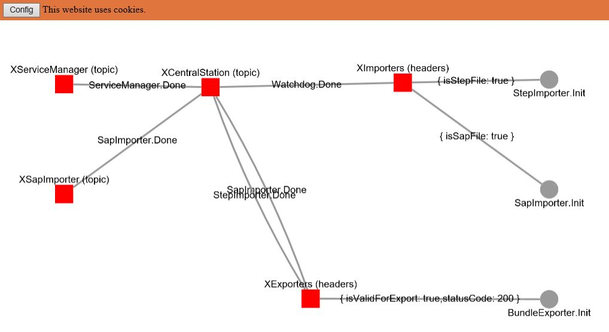

# rabbitmq-visualizer

... is a standalone web page that uses the [RabbitMQ Management HTTP API](https://rawcdn.githack.com/rabbitmq/rabbitmq-management/v3.8.0/priv/www/api/index.html) to display the internal structure of a RabbitMQ server. It is designed with a focus on backward compatibility to support Internet Explorer as well. Testing was done on Windows Servers.



## Setup

1. Clone the repository

```
git clone https://github.com/witling/rabbitmq-visualizer
```

2. Install the required JavaScript dependencies (PowerShell)

```
./deps.ps1
```

3. Open `index.html` in your browser
